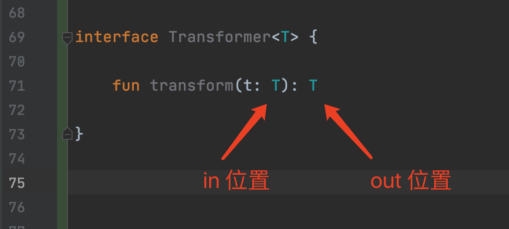

# Kotlin 泛型

### 声明泛型类

和Java一样，Kotlin通过在类名称后面加上一对尖括号，并把 **类型参数** 放在尖括号内来声明泛型类和泛型接口。

```kotlin
interface List<T> {
    
    operator fun get(index: Int): T
    
}
```

### 声明泛型方法

```kotlin
fun <T> sum(t: T) {
    //do something
}
```

### 类型参数约束

#### 上界约束

如果你把一个类型指定为泛型 **类型形参** 的上界约束，在泛型类型具体的初始化中，其对应的类型实参就必须是这个具体类型或者它的子类型。

在Kotlin中声明带泛型上限的类和方法

```kotlin
class Base<T:Number> {

}

fun <T : Number> test(t: T) {
    //do something
}
```

在Java中声明带泛型上限的类和方法

```java

class Base<T extends Number> {

}

public <T extends Number> void test(T num) {
     //do something
}
```

传递T的类型实参必须是 Number 或者 Number 的子类。


为类型参数指定多个约束的语法

Kotlin的语法

```kotlin
//泛型类
class Base<T> where T : CharSequence, T : Appendable {
  
    
}

//泛型方法
fun <T> test(num: T) where T : CharSequence, T : Appendable {
    //do something
}
```

Java的语法

```java
//泛型类
class Base<T extends CharSequence & Appendable> {

}

//泛型方法
public <T extends CharSequence & Appendable> void test(T num) {
        
}

```

### 声明带实化类型参数的函数

**注意**：实化类型参数只能用在内联函数上。

看一个例子

```kotlin
fun <T> isA(value: Any): Boolean {
    
    //编译错误，无法进行类型检查，只能看做Any类型
    //return value is T
    return false
}
```

由于泛型的**类型擦除**，在运行的时候无法知道传入的类型实参具体是什么。所以无法进行类型检查，只能看做Any类型。

内联函数的类型形参能够被实化，意味着你可以在运行时引用实际的类型实参。

```kotlin
inline fun <reified T> isAReified(value: Any): Boolean {
    return value is T
}
```

**reified** 声明了类型参数不会在运行时被擦除(实化类型参数)。


使用

```
isAReified<String>("abc")//true
isAReified<String>(123)//false
```

实化类型参数一个有意义的例子。下面是Kotlin库函数 `filterIsInstance` 方法的简化版本。

```kotlin
inline fun <reified T> Iterable<*>.filterIsInstance(): List<T> {

    val destination = ArrayList<T>()
    for (element in this) {
        if (element is T) {
            destination.add(element)
        }
    }
    return destination
}
```

使用

```kotlin
val items = listOf("one", 2, "three")
println(items.filterIsInstance<String>())
```

通过指定`String`作为函数的类型实参，表明只对字符串感兴趣。因此函数的返回类型是 `List<String>`。在这种情况下，类型实参在运行时是已知的，函数 `filterIsInstance` 可以检查列表中的值是不是类型实参类型的实例。

**为什么实化只对内联函数有效**？因为编译器把实现内联函数的字节码插入到每一次调用发生的地方。生成的字节码引用了具体类，而不是类型参数，它不会被运行时发生的类型参数擦除影响。

**注意**：带 **reified**类型参数的内联函数不能再Java代码中调用。

看一个在Android中的例子，使用实化类型参数替代类引用。

在Java中定义一个通用的startActivity的方法
```java
public <T extends Activity> void startActivity(Class<T> clazz) {
    Intent intent = new Intent(this, clazz);
    startActivity(intent);
}
```

调用需要传递Class对象。

```java
startActivity(MainActivity.class);
```

Kotlin使用实化类型参数替代类引用

```kotlin
//给Context定义一个扩展函数
inline fun <reified T : Activity> Context.startActivity() {
    //内联函数中的实化类型参数，可以引用到具体的类
    val intent = Intent(this, T::class.java)
    startActivity(intent)
}
```

调用直接传递类名即可

```kotlin
startAct<MainActivity>()
```


### 泛型的变型

**变型**的概念描述了拥有相同基础类型和不同类型实参(泛型)类型直接是如何关联的：例如`List<String>` 和 `List<Any>` 之间是如何关联。

先看一个例子

假设Orange类是Fruit类的子类，`Crate<T>` 是一个泛型类，那么，`Crate<Orange>` 是 `Crate<Fruit>` 的子类型吗？直觉可能告诉你，Yes。但是，答案是No。

对于Java而言，两者没有关系。对于Kotlin而言，`Crate<Orange>` 可能是`Crate<Fruit>` 的子类型，或者其超类型，或者两者没有关系，这取决于`Crate<T>` 中的 T 在类 Crate 中是如何使用的。

* invariance（不变型）：也就是说，`Crate<Orange>` 和 `Crate<Fruit>` 之间没有关系。
* covariance（协变）：也就是说，`Crate<Orange>` 是 `Crate<Fruit>` 的子类型。
* contravariance（逆变）：也就是说，`Crate<Fruit>` 是 `Crate<Orange>` 的子类型。


#### 不变型

一个泛型类一一例如 `MutableList` 如果对于任意两种类型 A，B，`MutableList<A＞`既不是 `MutableList<B>` 的子类型也不是它的超类型，它被称为在该类型参数上是不变型的。 Java中所有的类都是不变型的(尽管那些类具体的使用可以标记成可变型的，稍后你就会看到)。

### 协变：保留子类型化关系

一个协变类是一个泛型类(我们以`Producer<T>`为例)，对这种类来说，下面的描述是成立的：如果A是B的子类型，那么`Producer<A>` 就是 `Producer<B>` 的子类型。我们说，子类型被保留了。例如，`Producer<Cat>` 是 `Producer<Animal>` 的子类型，因为 Cat 是 Animal 的子类型。

在Kotlin中要声明类在某个类型参数上是可以协变的，在该类型参数的名称前面加上**out**关键字即可。

```kotlin
interface Producer<out T> {

    fun produce(): T
}
```

看一个例子

```kotlin
//open关键字，让类可以被继承
open class Animal {

    fun fead() {
        println("喂养小动物")
    }
}


class Cat : Animal() {

    fun cleanLitter() {

    }
}

class Herd<out T : Animal> {

    val list = listOf<T>()

    val size: Int get() = list.size


    operator fun get(i: Int): T {
        return list[i]
    }
}

fun feedAll(animals: Herd<Animal>) {

    for (i in 0 until animals.size) {
        animals[i].fead()
    }
}
```

使用

```kotlin
fun takeCatOfCats(cats: Herd<Cat>) {
    for (i in 0 until cats.size) {
        cats[i].cleanLitter()
    }
    //注释1处
    feedAll(cats)
}
```

注释1处，不需要类型转换，可以看到通过协变保留了 Animal 和 Cat 之间的子类型关系。`Herd<Cat>` 是 `Herd<Animal>` 的子类。

**注意**：你不能把任何类都变成协变的：这样不安全。让类在某个类型参数变为协变，限制了该类中对该类型参数使用的可能性。要保证类型安全，它只能用在所谓的 `out` 位置，意味着这个类只能生产类型 T 的值而不能消费它们。

在类成员的声明中类型参数的使用可以分为 `in` 位置和 `out` 位置。考虑这样类，它声明了一个类型参数 T 并包含了一个使用 T 的函数。如果函数是把 T 当成返
回类型，我们说它在 `out` 位置。这种情况下，该函数生产类型为 T 的值。如果 T 用作函数参数的类型，它就在 `in` 位置。这样的函数消费类型为 T 的值，如下图所示：



>对于Kotlin而言，可以这么说： Producer out，Consumer in。

类的类型参数前的 `out` 关键字要求所有使用 T 的方法只能把 T 放在 `out` 位置而不能放在 `in` 位置。这个关键宇约束了使用 T 的可能性，**这保证了对应子类型关系的安全性**。


重申一下类型参数`T`上的关键字 `out` 有两层含义：

1. 子类型化被保留(`Producer<Cat>` 是 `Producer<Animal>` 的子类型)
2. T 只能用在out的位置

### Java中实现协变的方式：上限通配符。

```java
class Fruit {

}

class Orange extends Fruit {

}

public static void main(String[] args) {
    //编译错误
    //List<Fruit> fruits = new ArrayList<Orange>();
    
    List<? extends Fruit> fruits = new ArrayList<Orange>();
    
    //编译错误:不能添加任何类型的对象
    //fruits.add(new Orange());
    //fruits.add(new Fruit());
    //fruits.add(new Object());
    //fruits.add(null);//可以这么做，但是没有意义
    //我们知道，返回值肯定是Fruit
    Fruit f = fruits.get(0);
}
```

>我们之所以可以安全地将 `ArrayList<Orange>` 向上转型为 `List<? extends Fruit>` ，是因为编译器限制了我们对于 `List<? extends Fruit>` 类型部分方法的调用。例如 `void add(T t)` 方法，以及一切参数中含有 T 的方法（称为消费者方法），因为这些方法可能会破坏类型安全，只要限制这些方法的调用，就可以安全地将 `ArrayList<Orange>` 转型为 `List<? extends Fruit>` ，这就是所谓的协变，通过限制对于消费者方法的调用，使得像 `List<? extends Fruit>` 这样的类型成为单纯的“生产者”，以保证运行时的类型安全。


### 逆变：翻转子类型化关系

逆变的概念可以看成是协变关系的镜像：对一个逆变类来说，它的子类型化关系与用作**类型实参**的类的子类型化关系是相反的。

一个在类型参数上**逆变**的类是这样一个泛型类(我们以`Consumer<T>`为例)，对这种类来说，下面的描述成立：如果B是A的子类型，那么 `Consumer<A>` 就是`Consumer<B>`的子类型。
例如，Cat 是 Animal 的子类型，但是`Consumer<Animal>` 却成了 `Consumer<Cat>` 的子类型。

我们从`Comparator`接口的例子开始，该接口定义了一个compare方法，用来比较给定的两个对象。


```koltin
interface Comparator<in T> {

    fun compare(e1: T, e2: T): Int

}
```

如你所见，compare方法只是消费类型为T的值。这说明T值在`in`位置使用，因此它的声明之前用了`in`关键字。

一个为特定类型的值定义的比较器显然可以用来比较该类型任意子类型的值。例如，如果有一个`Comparator<Any>`，可以用它比较任意具体类型。

举个例子

```kotlin
val anyComparator: Comparator<Any> = Comparator<Any> { o1, o2 ->
    o1.hashCode() - o2.hashCode()
}
val list: List<String> = listOf()

//期望传入一个Comparator<String>
list.sortedWith(anyComparator)
```

```kotlin
public fun <T> Iterable<T>.sortedWith(comparator: Comparator<in T>): List<T> {

}
```

`List<String>`调用`sortedWith`方法期望传入一个`Comparator<String>`， 传给它一个能比较更一般类型的比较器是安全的。如果你要在特定类型的对象上执行比较，可以使用能处理该类型或者它的超类型的比较器。这说明 `Comparator<Any>` 是 `Comparator<String>` 的子类型，其中Any是String的超类型。不同类型之间的子类型关系和这些类型的比较器之间的子类型化关系截然相反。


### Java中实现逆变的方式：下限通配符。
 
 ```java
public static void main(String[] args) {

    List<Object> objs = new ArrayList<>();
    objs.add(new Object());
    List<? super Fruit> canContainFruits = objs;
    //没有问题，可以写入Fruit类及其子类
    canContainFruits.add(new Orange());
    canContainFruits.add(new Fruit());
    //无法安全地读取,canContainFruits完全可能包含Fruit基类的对象，比如这里的Object
    //Fruit f = canContainFruits.get(0);
    //总是可以读取为Object，然而这并没有太多意义
    Object o = canContainFruits.get(0);
 }
 ```

>编译器限制了我们对于 `List<? super Fruit>` 类型部分方法的调用。例如`T get(int pos)`方法，以及一切返回类型为 T 的方法（称为生产者方法），因为我们不能确定这些方法的返回类型，只要限制这些方法的调用，就可以安全地将 `ArrayList<Object>` 转型为 `List<? super Fruit>`。这就是所谓的逆变，通过限制对于生产者方法的调用，使得像 `List<? super Fruit>` 这样的类型成为单纯的“消费者”。
 
 
 小结：
 
 * Kotlin中通过类型形参前面的`in`和`out`关键字实现协变和逆变。
 * Java中通过`<? extends T>`上限的通配符和`<? super T>`下限通配符实现协变和逆变。


### 使用点变型：在类型出现的地方指定变型

先说一下**声明点变型**：在类声明的时候指定变型修饰符。这些修饰符会应用到所有类被使用的地方。**在声明时一次性制定变型让代码变得简洁和优雅的多。** 

Kotlin中声明点变型

```kotlin
public interface List<out E> : Collection<E> {

}
```
List接口中将类型参数 `E` 声明为是协变的。

声明点变型带来了更简洁的代码，因为只用指定一次变型修饰符，所有个类的使用者都不用再考虑这些了。


Java中所有的类都是不变型的。

```java
//编译错误，在Java中无法这样声明泛型类
class MyList< ? extends T> {

}

//编译错误，在Java中无法这样声明泛型类
class MyList< ? super T> {

}
```

**使用点变型**：在每一次使用带类型参数的类型的时候指定这个类型参数是否可以用它的子类型或者超类型替换。

Koltin中使用点变型的例子。

```kotlin
/**
 * @param source 来源集合
 * @param destination 目标集合
 * 来源的元素类型是目标元素类型的子类型
 */
fun <T : R, R> copyData1(source: MutableList<T>, destination: MutableList<R>) {
    for (item in source) {
        destination.add(item)
    }
}
```

```kotlin
val ints = mutableListOf(1, 2, 3)
val anyItems = mutableListOf<Any>()
copyData1(ints, anyItems)
```

在这个例子中，来源集合只是读取，目标集合只是写入。在这种情况下集合元素的类型不需要精确匹配。例如，把一个字符串的集合拷贝到可以包含任意对象的集合中一点问题也没有。

但是Kotlin提供了一种更优雅的表达方式。当函数的实现调用了那些类型参数只出现在`out`位置(或只出现在`in`位置)的方法时，可以充分利用这一点，在函数定义中给特定用途的类型参数加上变型修饰符。

使用变型修饰符修改上面的例子。

代码清单 9.16

```kotlin
/**
 *  MutableList<out T> 和Java中的MutableList<? extends T> 是一个意思
 */
 fun <T> copyData2(source: MutableList<out T>, destination: MutableList<T>) {
    for (item in source) {
        destination.add(item)
    }
}
```

因为来源集合只是读取(生产)元素，即类型参数只出现在 `out` 位置，可以给类型参数加上 `out` 关键字。

```kotlin
/**
 *  MutableList<in T> 对应到 Java的 MutableList<? super T>
 */
fun <T> copyData3(source: MutableList<T>, destination: MutableList<in T>) {
    for (item in source) {
        destination.add(item)
    }
}
```
因为目标集合只是添加(消费)元素，即类型参数只出现在 `in` 位置，可以给类型参数加上 `in` 关键字。


可以为类型声明中**类型参数** 任意的用法指定变型修饰符，这些用法包括：形参类型（就像代码清单 9.16 这样）、局部变量类型、函数返回类型 等等。这里发生的一切被称作**类型投影**(受限)。


### 类型投影(受限)

在代码清单 9.16中，我们说source不是一个常规的MutableList，而是个投影(受限)的 MutableList，只能调用返回类型是泛型类型参数的那些方法，或者严格地讲，只在`out`位置使用它的方法。编译器禁止调用使用类型参数做实参(类型)的那些方法(在in位置使用类型参数)。

看一个类型投影的例子

```kotlin
val list: MutableList<out Number> = mutableListOf()
//编译错误，无法向MutableList添加数据
list.add(3)
```

在上面的代码中，我们声明了一个`MutableList<Number>`对象，但是发现我们无法调用MutableList的`fun add(element: E)`方法了。因为我们用`out`来指定类型参数`Number`是协变的。这时候我们的MutableList是一个类型投影(受限)的MutableList。编译器禁止调用使用类型参数做实参(类型)的那些方法(在in位置使用类型参数)来保证类型安全。

### 星号投影：使用*替代类型参数

在Kotlin中`MyType<*>` 对应于Java的`Mytype<?>`，表示我们不关心关于泛型实参的任何信息。对于`MutableList<*>`这样一个列表，因为你不知道是哪个类型，所以无法向其中写入任何东西。但是读取是可行的，因为列表中的值都能匹配Kotlin所有类型的超类型`Any?`。

参考链接：

* 《Kotlin实战》
* [Java和Kotlin中泛型的协变、逆变和不变](https://www.jianshu.com/p/0c2948f7e656)
* [Java 泛型，你了解类型擦除吗？](https://blog.csdn.net/briblue/article/details/76736356)
